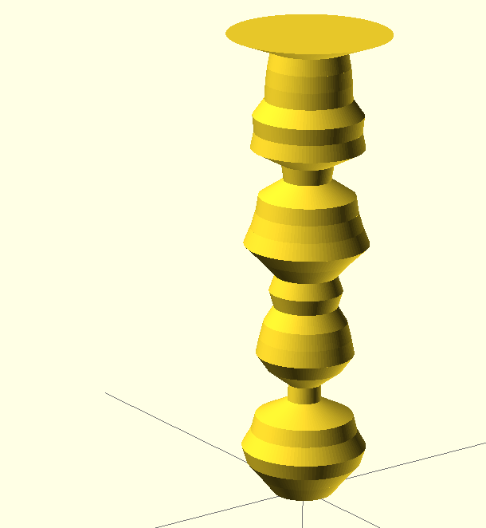
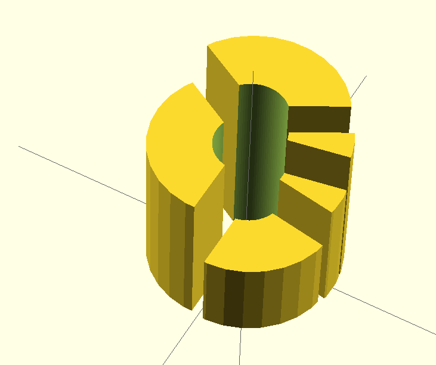
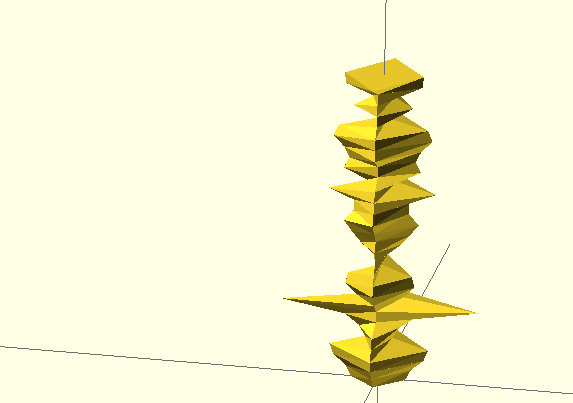
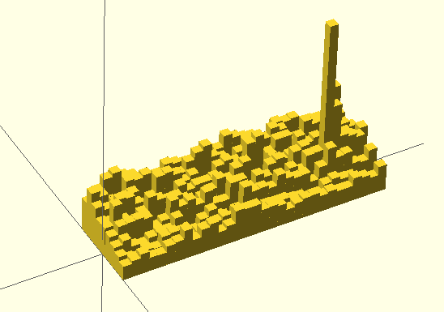
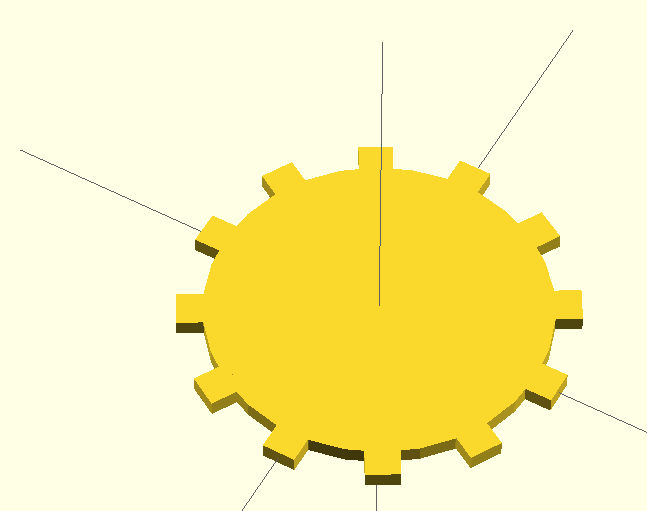

.. _examples:

Examples
========

The following chapter demonstrates a few code examples of how to use the
Tangible library.

.. _example_simple_tower:

A Simple Tower
--------------

This example describes a simple round tower (:class:`CircleTower1D
<tangible.shapes.vertical.CircleTower1D>`) where the radius of the layers
corresponds to the datapoint. The dataset describes the number of web site
visits on http://blog.dbrgn.ch/ during the month of September 2013. The value
range is normalized to a range between 10 and 50 using a linear scale.

**Code**

.. sourcecode:: python

    from tangible import scales
    from tangible.shapes.vertical import CircleTower1D
    from tangible.backends.openscad import OpenScadBackend

    # Normalize raw data
    visits = [53, 69, 86, 92, 81, 76, 37, 36, 62, 76, 72, 67, 55, 61, 54,
              72, 92, 84, 78, 75, 45, 48, 85, 81, 83, 69, 68, 66, 62, 115]
    scale = scales.linear([min(visits), max(visits)], [10, 50])
    datapoints = map(scale, visits)

    # Create shape
    tower = CircleTower1D(datapoints, layer_height=10)

    # Render OpenSCAD code
    code = tower.render(backend=OpenScadBackend)
    print code

**Result**

.. _example_multidimensional_data:

Multi Dimensional Data
----------------------

Here we have two dimensional data, represented as two lists of integers. The
first list should be mapped to the angle of the "pie slices", while the second
list should be mapped to the height of each slice. Additionally, we'll add a
center radius to make the model look like a donut, and we'll explode the slices.

**Code**

.. sourcecode:: python

    from tangible.shapes.pie import AngleHeightPie2D
    from tangible.backends.openscad import OpenScadBackend

    # Data
    datapoints = [
        [30, 30, 5, 5, 20], # Angle
        [18, 23, 20, 15, 10], # Height
    ]

    # Create shape
    pie = AngleHeightPie2D(datapoints, inner_radius=4, explode=1)

    # Render OpenSCAD code
    code = pie.render(backend=OpenScadBackend)
    print code

**Result**

.. _example_csv:

Reading Data from CSV
---------------------

Often the data that you want to visualize is not already available as a Python
datastructure, but in formats like JSON or CSV. Here's a small example where
website visitor data is read from the CSV exported by Google Analytics. Then the
number of visits and the average visit duration are mapped to the distance
between opposing corners of a rhombus tower.

**Code**

.. sourcecode:: python

    import csv
    from datetime import timedelta
    from tangible.shapes.vertical import RhombusTower2D
    from tangible.backends.openscad import OpenScadBackend

    # Read data into list
    datapoints = [[], []]
    with open('analytics-sep-13.csv', 'r') as datafile:
        reader = csv.DictReader(datafile)
        for row in reader:
            datapoints[0].append(int(row['Visits']))
            h, m, s = map(int, row['AvgDuration'].split(':'))
            duration = timedelta(hours=h, minutes=m, seconds=s)
            datapoints[1].append(duration.total_seconds())

    # Create shape
    tower = RhombusTower2D(datapoints, layer_height=10)

    # Render OpenSCAD code
    code = tower.render(backend=OpenScadBackend)
    print code

**CSV**

.. sourcecode:: csv

    Day,Visits,AvgDuration
    9/1/13,53,00:00:51
    9/2/13,69,00:01:01
    9/3/13,86,00:01:24
    ...

**Result**

.. _example_grouped_data:

Grouped Data
------------

Some one dimensional datasets don't work well when visualized directly. An
example would be daily website visitor statistics during a full year, a single
bar graph would be much too wide. But by grouping the data from the :ref:`CSV
example <example_csv>` into months, a :class:`BarsND
<tangible.shapes.bars.BarsND>` graph can be constructed:

**Code**

.. sourcecode:: python

    import csv
    from itertools import chain
    from tangible import scales
    from tangible.shapes.bars import BarsND
    from tangible.backends.openscad import OpenScadBackend

    # Read data into list
    datapoints = [list() for i in xrange(9)]
    with open('analytics-full-13.csv', 'r') as datafile:
        reader = csv.DictReader(datafile)
        for row in reader:
            date = row['Day']
            month = int(date.split('/', 1)[0])
            visits = int(row['Visits'])
            datapoints[month - 1].append(visits)

    # Normalize data
    all_datapoints = list(chain.from_iterable(datapoints))
    scale = scales.linear([min(all_datapoints), max(all_datapoints)],
                          [10, 150])
    datapoints = map(lambda x: map(scale, x), datapoints)

    # Create shape
    bars = BarsND(datapoints, bar_width=7, bar_depth=7)

    # Render OpenSCAD code
    code = bars.render(backend=OpenScadBackend)
    print code

**Result** 

.. _example_custom_shapes:

Creating Custom Shapes from AST
-------------------------------

It's not necessary to rely on the provided shape classes only, you can also
create your own shapes by using the :ref:`AST <ast>` objects directly.

The easiest and cleanest way to do this, is to create a subclass of the
:class:`BaseShape <tangible.shapes.base.BaseShape>` class and to override its
``_build_ast`` method:

**Code**

.. sourcecode:: python

    from tangible.shapes.base import BaseShape
    from tangible import ast
    from tangible.backends.openscad import OpenScadBackend

    # Create custom shape
    class Cogwheel(BaseShape):
        def _build_ast(self):
            cogs = []
            for i in xrange(18):
                cog = ast.Rectangle(2, 2)
                translated = ast.Translate(9.5, -1, 0, cog)
                rotated = ast.Rotate(i * 30, (0, 0, 1), translated)
                cogs.append(rotated)
            return ast.Union([ast.Circle(radius=10)] + cogs)

    # Render shape
    f = Cogwheel()
    code = f.render(backend=OpenScadBackend)
    print code

**Result**

