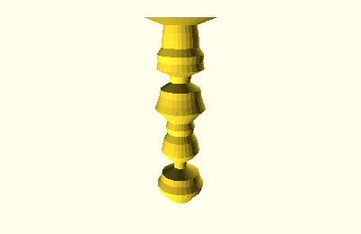
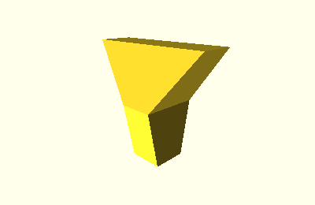

Shapes
======

Shapes make it easier to generate specific models from data, without having to
manipulate AST objects directly.

Inheritance Diagram
-------------------

.. inheritance-diagram::
    tangible.shapes
    :parts: 1

Shape Classes
-------------

.. autoclass:: tangible.shapes.Shape
    :members:

.. autoclass:: tangible.shapes.BarsShape
    :members:

.. autoclass:: tangible.shapes.VerticalShape
    :members:

Bar Shapes
##########

.. autoclass:: tangible.shapes.Bars2D
    :members:
.. image:: _static/img/shapes/bars_2d.png

.. autoclass:: tangible.shapes.Bars3D
    :members:

Vertical Shapes
###############

.. autoclass:: tangible.shapes.CircleTower1D
    :members:

.. autoclass:: tangible.shapes.SquareTower1D
    :members:
.. image:: _static/img/shapes/square_tower_1d.png

.. autoclass:: tangible.shapes.RectangleTower2D
    :members:

.. autoclass:: tangible.shapes.RhombusTower2D
    :members:
.. image:: _static/img/shapes/rhombus_tower_2d.png
