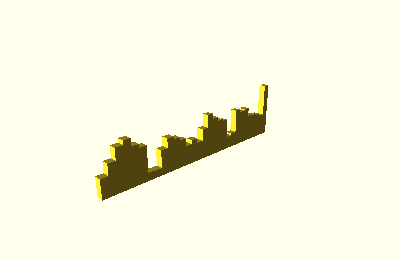
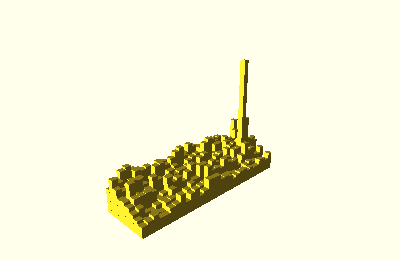

.. _bar_shapes:

Bar Shapes
==========

Bar shapes consist of several bars that start on ``z=0`` and have a height
depending on the corresponding datapoint. They can be aligned in rows, and rows
can be combined to create 3D bar graphs.

Class Hierarchy
---------------

.. inheritance-diagram::
    tangible.shapes.bars.Bars1D
    tangible.shapes.bars.BarsND
    :parts: 2

Base Class
----------

.. autoclass:: tangible.shapes.bars.BarsShape
    :members:

Shape Classes
-------------

.. autoclass:: tangible.shapes.bars.Bars1D
    :members:

.. autoclass:: tangible.shapes.bars.BarsND
    :members:

