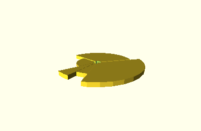
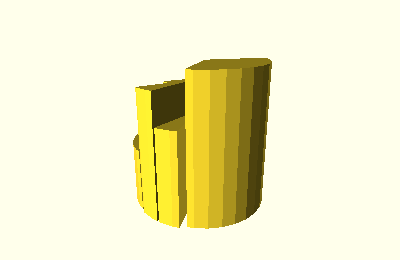

Pie Shapes
==========

A pie shape can represent data as angle, height or radius of the corresponding
slice. It is possible to define an inner radius (-> donut) and to explode the
slices.

Class Hierarchy
---------------

.. inheritance-diagram::
    tangible.shapes.pie.AnglePie1D
    tangible.shapes.pie.RadiusPie1D
    tangible.shapes.pie.HeightPie1D
    tangible.shapes.pie.AngleRadiusPie2D
    tangible.shapes.pie.AngleHeightPie2D
    tangible.shapes.pie.RadiusHeightPie2D
    tangible.shapes.pie.AngleRadiusHeightPie3D
    :parts: 2

Base Class
----------

.. autoclass:: tangible.shapes.pie.PieShape
    :members:

Shape Classes
-------------

.. autoclass:: tangible.shapes.pie.AnglePie1D
    :members:

.. autoclass:: tangible.shapes.pie.RadiusPie1D
    :members:

.. autoclass:: tangible.shapes.pie.HeightPie1D
    :members:

.. autoclass:: tangible.shapes.pie.AngleRadiusPie2D
    :members:

.. autoclass:: tangible.shapes.pie.AngleHeightPie2D
    :members:

.. autoclass:: tangible.shapes.pie.RadiusHeightPie2D
    :members:

.. autoclass:: tangible.shapes.pie.AngleRadiusHeightPie3D
    :members:

