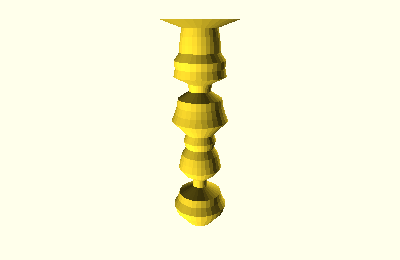
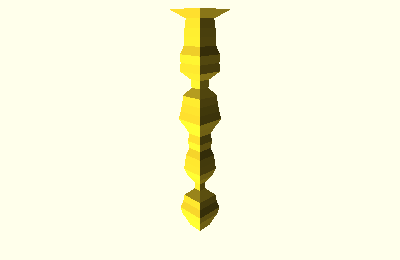
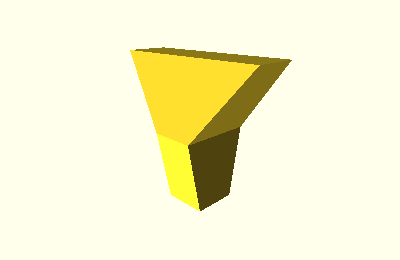
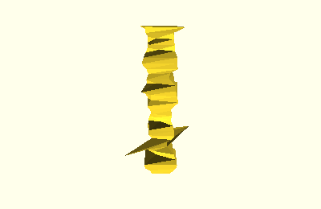
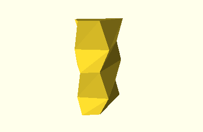

.. _vertical_shapes:

Vertical Shapes
===============

A vertical shape is a shape with layers stacked on top of each other, with a
fixed layer height, for example a round tower where the radius corresponds to
the datapoint.

Class Hierarchy
---------------

.. inheritance-diagram::
    tangible.shapes.vertical.CircleTower1D
    tangible.shapes.vertical.SquareTower1D
    tangible.shapes.vertical.RectangleTower2D
    tangible.shapes.vertical.RhombusTower2D
    tangible.shapes.vertical.QuadrilateralTower4D
    :parts: 2

Base Class
----------

.. autoclass:: tangible.shapes.vertical.VerticalShape
    :members:

Shape Classes
-------------

.. autoclass:: tangible.shapes.vertical.CircleTower1D
    :members:

.. autoclass:: tangible.shapes.vertical.SquareTower1D
    :members:

.. autoclass:: tangible.shapes.vertical.RectangleTower2D
    :members:

.. autoclass:: tangible.shapes.vertical.RhombusTower2D
    :members:

.. autoclass:: tangible.shapes.vertical.QuadrilateralTower4D
    :members:

