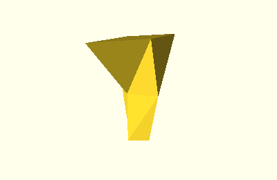

Vertical Shapes
===============

A vertical shape is a shape with layers stacked on top of each other, with a
fixed layer height, for example a round tower where the radius corresponds to
the datapoint.

Class Hierarchy
---------------

.. inheritance-diagram::
    tangible.shapes.CircleTower1D
    tangible.shapes.SquareTower1D
    tangible.shapes.RectangleTower2D
    tangible.shapes.RhombusTower2D
    tangible.shapes.QuadrilateralTower4D
    :parts: 1

Base Class
----------

.. autoclass:: tangible.shapes.VerticalShape
    :members:

Shape Classes
-------------

.. autoclass:: tangible.shapes.CircleTower1D
    :members:
.. image:: ../_static/img/shapes/circle_tower_1d.png

.. autoclass:: tangible.shapes.SquareTower1D
    :members:
.. image:: ../_static/img/shapes/square_tower_1d.png

.. autoclass:: tangible.shapes.RectangleTower2D
    :members:
.. image:: ../_static/img/shapes/rectangle_tower_2d.png

.. autoclass:: tangible.shapes.RhombusTower2D
    :members:

.. autoclass:: tangible.shapes.QuadrilateralTower4D
    :members:
.. image:: ../_static/img/shapes/quadrilateral_tower_4d.png
