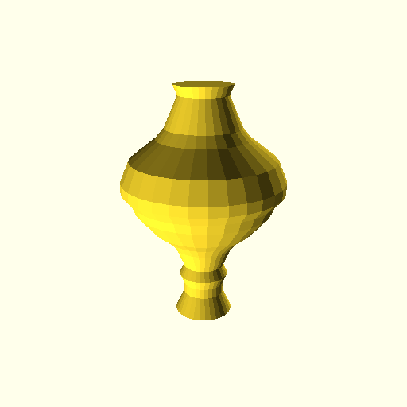

Usage
=====

Tangible was designed to be very straightforward to use. Common data
visualizations should be possible with just a few lines of code.

Visualizing data with Tangible consists of three steps: Preprocessing the data,
creating a shape instance and finally rendering the code using the desired
backend.

Preprocessing Data
------------------

Many times the data is not yet in the right form for visualization. Let's say
that you have air temperature measurements for every hour during an entire day.
The temperature range is between 8°C during the night and 22°C during the day.

.. sourcecode:: python

    >>> temperatures = [
    >>>     10, 9, 8, 8, 9, 8, 9, 10, 12, 15, 17, 19,
    >>>     20, 22, 22, 21, 20, 17, 14, 12, 11, 10, 9, 10
    >>> ]

To visualize the data, you want to create a round tower where the radius of a
slice corresponds to a temperature measurement. But the temperatures are not
well suited to be used directly as millimeter values. Therefore you want to
linearly transform the range 8–22 (°C) to the range 10–40 (mm).

Tangible provides helper functions for this called *scales*. First a linear
scale needs to be constructed:

.. sourcecode:: python

    >>> from tangible import scales
    >>> scale = scales.linear(domain=[8, 22], codomain=[10, 40])

The returned object is the actual scaling function. It can be used directly:

.. sourcecode:: python

    >>> scale(8)
    10.0
    >>> scale(15)
    25.0
    >>> scale(22)
    40.0

...or it can be used in combination with Python's ``map()`` function:

.. sourcecode:: python

    >>> radii = map(scale, temperatures)
    >>> radii
    [14.285714285714285, 12.142857142857142, 10.0, 10.0, ...]

Now the data is ready to be visualized. There are also several other functions
to preprocess data, for example to group or aggregate datapoints. For more
information, take a look at the :ref:`utils` docs.

Creating a Shape Instance
-------------------------

Tangible provides many predefined shapes that can be used directly. Currently
there are three types of shapes: :ref:`Vertical shapes <vertical_shapes>`,
:ref:`bar shapes <bar_shapes>` and :ref:`pie shapes <pie_shapes>`.

For the temperature tower, you need the :class:`CircleTower1D
<tangible.shapes.vertical.CircleTower1D>` shape from the
:mod:`tangible.shapes.vertical` module. The class requires two arguments:
The data list as well as the height of each layer.

.. sourcecode:: python

    >>> from tangible.shapes.vertical import CircleTower1D
    >>> tower = CircleTower1D(data=radii, layer_height=2)

An overview over all shape classes can be found in the :ref:`shape docs
<shapes>`.

Rendering the Code
------------------

Now the shape is ready to be rendered. First, choose the :ref:`desired backend
<backends>`. Right now, the only available backend is the :ref:`OpenSCAD backend
<backends_openscad>`.

.. sourcecode:: python

    >>> from tangible.backends.openscad import OpenScadBackend

Next, render the shape using this backend. For convenience, we write the
resulting code directly into a file.

.. sourcecode:: python

    >>> with open('tower.scad', 'w') as f:
    ...     code = tower.render(backend=openscad.OpenScadBackend)
    ...     f.write(code)

The OpenSCAD code can now be rendered on the command line (or alternatively from
the GUI tool) into an image for previewing or into an STL file for printing::

    $ openscad -o tower.png --render --imgsize=512,512 tower.scad
    CGAL Cache insert: cylinder($fn=0,$fa=12,$fs=2,h=5,r1=14.28)
    CGAL Cache insert: cylinder($fn=0,$fa=12,$fs=2,h=5,r1=12.14)
    ...
    $ openscad -o tower.stl --render tower.scad
    CGAL Cache insert: cylinder($fn=0,$fa=12,$fs=2,h=5,r1=14.28)
    CGAL Cache insert: cylinder($fn=0,$fa=12,$fs=2,h=5,r1=12.14)
    ...

The result:

A few more usage examples are available in the :ref:`examples` section.
